# Agentic Research & Decision Intelligence Platform

A complete multi-agent AI final project that plans, researches, analyzes, critiques, fact-checks, visualizes, writes, evaluates, and presents evidence-grounded research reports. The system is designed as a serious engineering and research prototype rather than a single chatbot wrapper.

The demo scenario is:

> Multi-agent AI systems for trustworthy clinical decision support

The system runs fully offline in deterministic mock mode, and can also run in real mode with OpenAI plus Tavily or SerpAPI adapters for prompt-specific planning, retrieval, synthesis, scoring, figures, Markdown/PDF reports, SQLite run memory, and a presentation artifact.

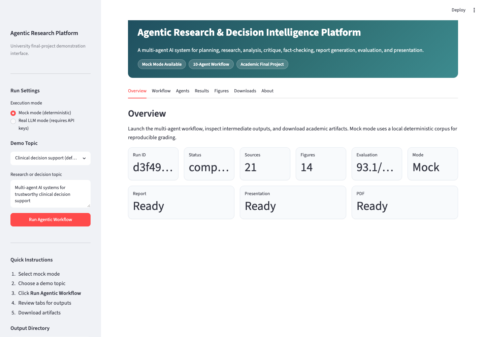

## What The System Does

Given a topic or decision scenario, the platform produces:

- A task decomposition and execution plan.
- A ranked evidence set from local mock data or external search adapters.
- Structured analysis tables and formulas.
- Critique and revision decisions.
- Claim-level fact checks with citation markers.
- Architecture diagrams, workflow diagrams, and evaluation charts.
- A professional final report in Markdown and LaTeX/PDF, plus a presentation.
- A saved run record with artifact paths and evaluation scores.

## Why It Is Agentic

The project is agentic because specialized agents make and pass structured decisions through shared state. The Planner decides the work breakdown, the Critic can route the workflow back to Research, the Fact-Checker can flag unsupported claims, and the Evaluator can route back to Report Writer if the quality score is too low. This means the control flow is conditional and inspectable, not just a fixed prompt chain.

## Features

- Ten specialized agents: Planner, Research, Data Analyst, Critic, Fact-Checker, Visualization, Report Writer, Evaluator, Presentation, and Memory.
- LangGraph-style orchestration with conditional revision loops.
- Deterministic mock mode through `USE_MOCK_LLM=true`.
- Real non-mock mode through the Streamlit UI, API, or `scripts/run_real_workflow.py`.
- FastAPI backend and Streamlit demonstration UI.
- SQLite persistence for run metadata and serialized state.
- Academic-style report with references, tables, formulas, figures, limitations, ethics, and reproducibility notes.
- LaTeX report source in `report/final_report.tex` and compiled academic PDF in `report/final_report.pdf`.
- Mermaid architecture/workflow diagrams, publication-ready PNG diagrams, and Matplotlib charts.
- Pytest unit, integration, API, and end-to-end tests.
- Docker and Docker Compose setup.

## Architecture Summary

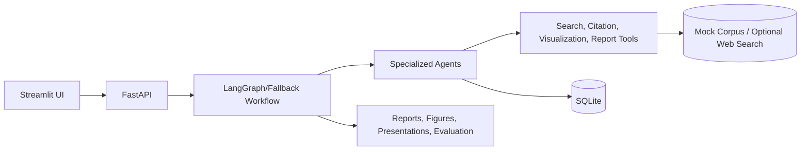
```mermaid
flowchart LR
  UI[Streamlit UI] --> API[FastAPI]
  API --> Graph[LangGraph/Fallback Workflow]
  Graph --> Agents[Specialized Agents]
  Agents --> Tools[Search, Citation, Visualization, Report Tools]
  Agents --> Memory[(SQLite)]
  Tools --> Data[(Mock Corpus / Optional Web Search)]
  Graph --> Outputs[Reports, Figures, Presentations, Evaluation]
```

The workflow is not a simple chain. The Critic Agent can send the process back to research when evidence is weak, and the Evaluator Agent can send the process back to report writing when quality is below threshold.

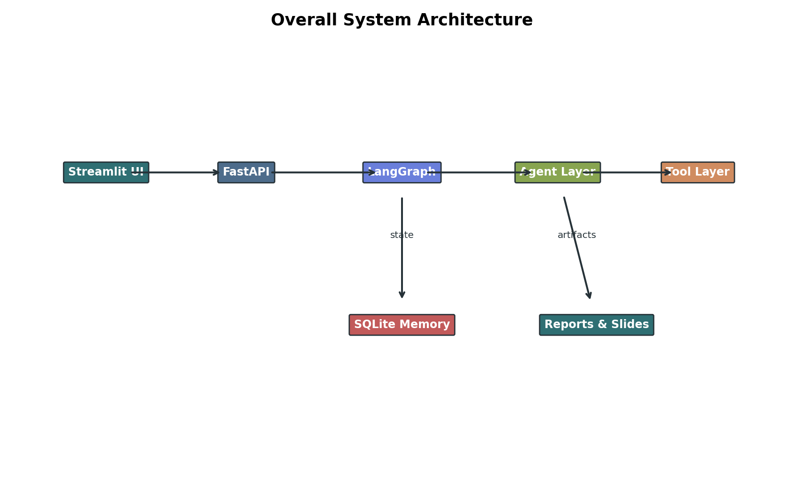

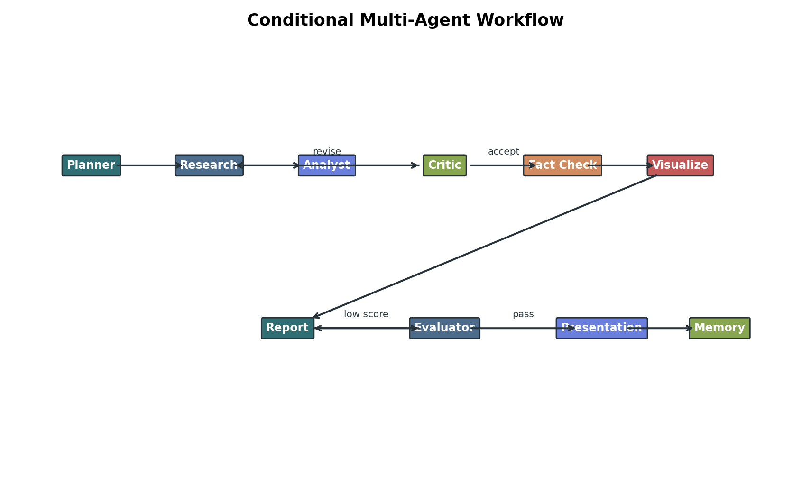

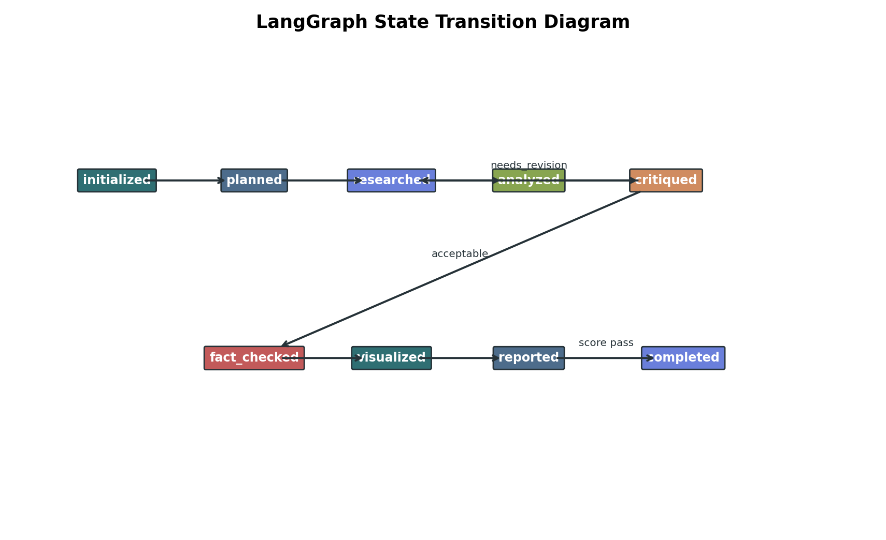

## Multi-Agent Workflow

```text
User Query
  -> Planner Agent
  -> Research Agent
  -> Data Analyst Agent
  -> Critic Agent
     -> Research Agent again if evidence is insufficient
  -> Fact-Checking Agent
  -> Visualization Agent
  -> Report Writer Agent
  -> Evaluator Agent
     -> Report Writer Agent again if score is below threshold
  -> Presentation Agent
  -> Memory Agent
```

All intermediate outputs are stored in `WorkflowState`, including plans, sources, tables, critiques, claim checks, figures, report paths, presentation paths, evaluation scores, and agent notes.

## Installation

Recommended:

```bash
python -m venv .venv
source .venv/bin/activate
pip install -r requirements.txt
cp .env.example .env
```

The project is compatible with Python 3.10+ and recommends Python 3.11+.

For the most polished report PDF, install a LaTeX distribution that provides `pdflatex`. If `pdflatex` is unavailable, the project still creates Markdown artifacts and records the limitation.

## Environment Variables

| Variable | Purpose | Default |
| --- | --- | --- |
| `USE_MOCK_LLM` | Runs deterministic local mode without paid keys | `true` |
| `MODEL_PROVIDER` | Model adapter label, for example `openai` | `mock` |
| `OPENAI_MODEL` | OpenAI chat model used in real mode | `gpt-4o-mini` |
| `OPENAI_API_KEY` | Optional external LLM key | empty |
| `TAVILY_API_KEY` | Optional web search key | empty |
| `SERPAPI_API_KEY` | Optional web search key | empty |
| `DATABASE_PATH` | SQLite memory location | `app/storage/agentic_platform.db` |
| `OUTPUT_DIR` | Generated artifact directory | `outputs` |
| `EVALUATION_THRESHOLD` | Score required before presentation | `78` |

## Run Backend

```bash
uvicorn app.main:app --reload
```

API endpoints:

- `GET /health`
- `POST /run`
- `GET /runs/{run_id}`
- `GET /runs/{run_id}/report`
- `GET /runs/{run_id}/report.pdf`
- `GET /runs/{run_id}/presentation`
- `GET /runs/{run_id}/figures`

Real-mode API example:

```bash
curl -X POST http://127.0.0.1:8000/run \
  -H "Content-Type: application/json" \
  -d '{"query":"Compare Iran and Turkey across economy, healthcare, education, technology, and geopolitical risk.","use_mock_llm":false}'
```

## User Interface

The Streamlit UI is the recommended professor demo surface. It supports topic input, mock/real mode selection, workflow execution, agent output inspection, evaluation metrics, figure preview, and artifact downloads.

```bash
streamlit run app/ui/streamlit_app.py
```

**Tabs:** Overview | Workflow | Agents | Results | Figures | Downloads | About

### Control panel (sidebar)

The left sidebar is the main control panel: execution mode, demo topic, **Run Agentic Workflow**, quick instructions, and output paths.


### Tab screenshots

| Overview | Workflow | Agents |
| --- | --- | --- |
|  | 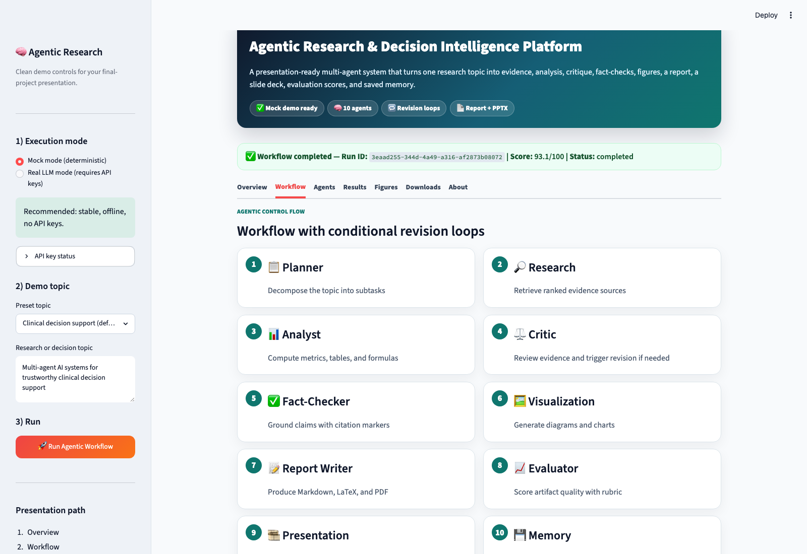 | 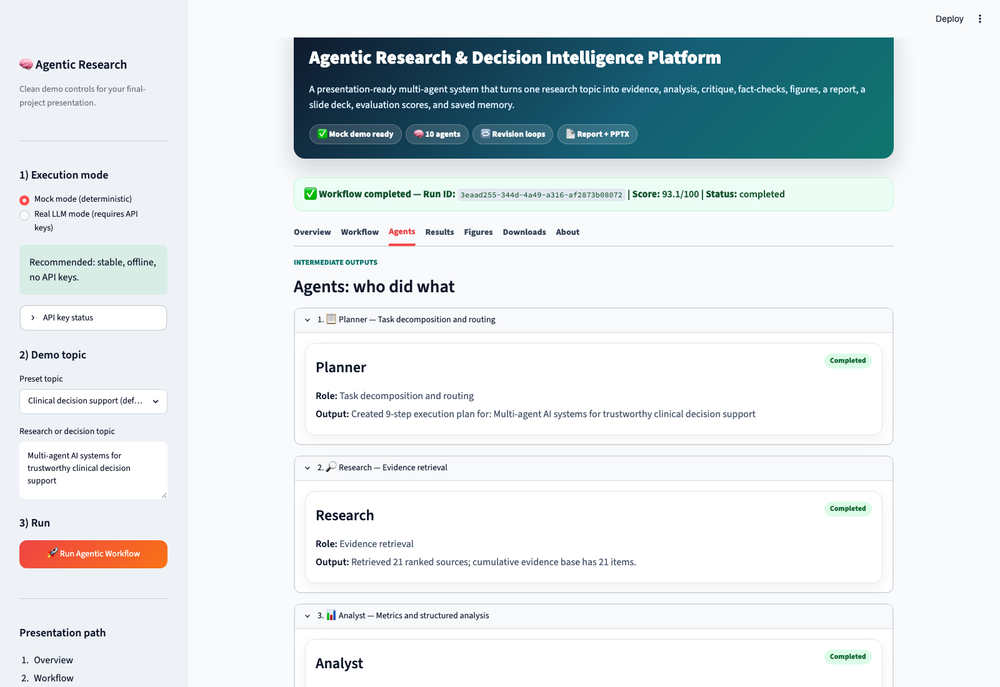 |

| Results | Figures | Downloads |
| --- | --- | --- |
| 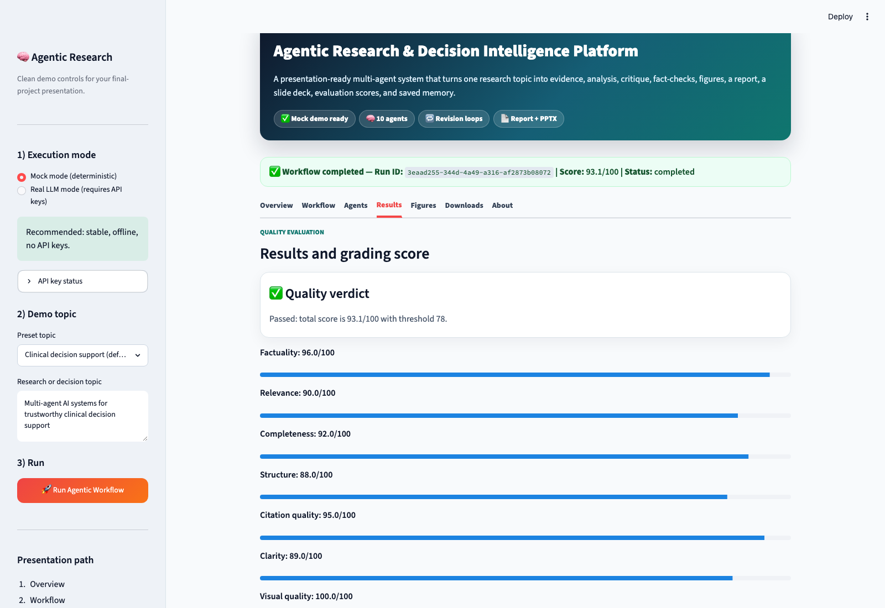 | 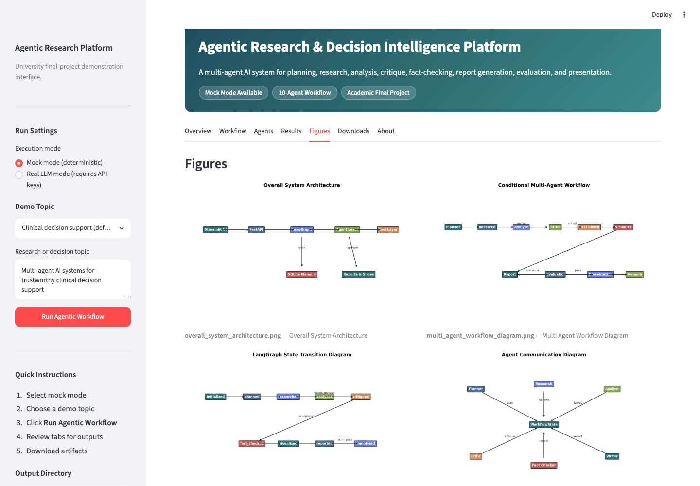 | 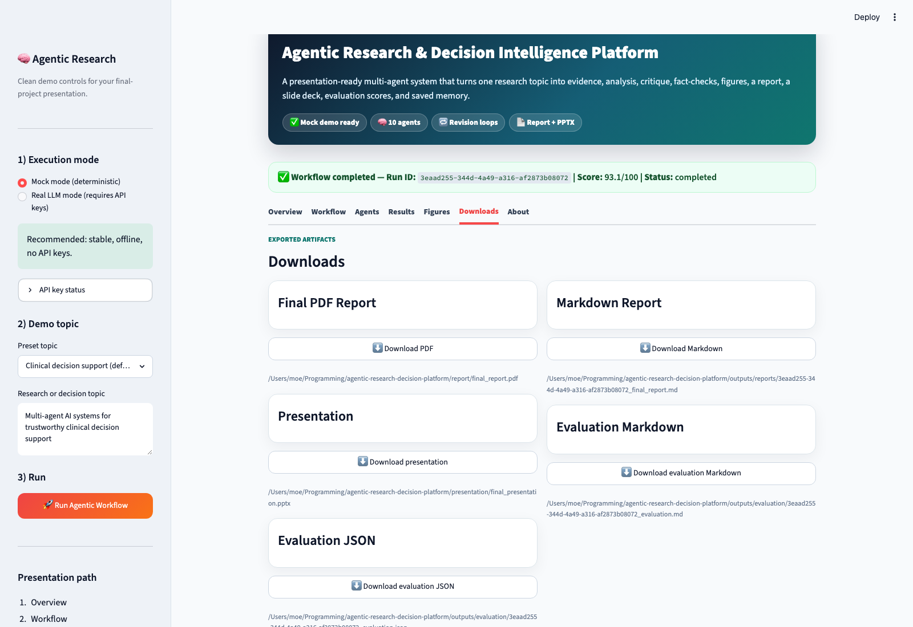 |

Screenshots are captured with Playwright after a seeded mock demo run. See [`docs/SCREENSHOT_GUIDE.md`](docs/SCREENSHOT_GUIDE.md).

Capture real browser screenshots (Playwright) and demo result images:

```bash
pip install playwright
python -m playwright install chromium
python scripts/capture_ui_screenshots.py
```

See [`docs/USER_GUIDE.md`](docs/USER_GUIDE.md) and [`docs/SCREENSHOT_GUIDE.md`](docs/SCREENSHOT_GUIDE.md).

## Run UI

```bash
streamlit run app/ui/streamlit_app.py
```

## Run Demo

```bash
python scripts/run_demo.py
```

This generates a run-specific report, figures, evaluation files, and presentation.

## Run Real Mode

Set `USE_MOCK_LLM=false` in `.env`, set `MODEL_PROVIDER=openai` when using OpenAI, and configure at least one of `OPENAI_API_KEY`, `TAVILY_API_KEY`, or `SERPAPI_API_KEY`. OpenAI is used for dynamic planning and synthesis; Tavily or SerpAPI is used for live source retrieval when available.

CLI:

```bash
python scripts/run_real_workflow.py "Compare Iran and Turkey across economy, healthcare, education, technology, and geopolitical risk."
```

UI:

```bash
streamlit run app/ui/streamlit_app.py
```

Then choose **Real LLM mode**, enter your prompt, and run the workflow. The run-specific PDF is written under `outputs/reports/{run_id}_final_report.pdf`. The latest run is also copied to `report/final_report.pdf`, so that canonical file is overwritten by each new report run.

## Generate Reports

```bash
python scripts/generate_report.py "Analyze how multi-agent AI systems can improve clinical decision support while reducing hallucination risks."
```

To regenerate the LaTeX report explicitly:

```bash
python scripts/generate_latex_report.py
```

To compile the academic PDF from existing LaTeX source and assets:

```bash
python scripts/build_report_pdf.py
```

Primary final report files:

- `report/final_report.tex`
- `report/final_report.pdf`
- `report/references.bib`

Run-specific PDFs are stored in `outputs/reports/` and are the safest way to reopen an exact previous result.

## Run Tests

```bash
pytest
```

Verbose mode:

```bash
pytest -v
```

or:

```bash
bash scripts/run_tests.sh
```

The test suite includes unit tests for the core agents, an integration test for the workflow, an end-to-end demo test, and an API health check test.

## Docker

```bash
cp .env.example .env
docker compose up --build
```

FastAPI will be available at `http://localhost:8000`; Streamlit will be available at `http://localhost:8501`.

## Example Outputs

Generated artifacts are saved in:

- `outputs/reports/`
- `outputs/figures/{run_id}/`
- `outputs/presentations/`
- `outputs/evaluation/`
- `report/final_report.md`
- `report/final_report.tex`
- `report/final_report.pdf`
- `presentation/final_presentation.md`
- `presentation/final_presentation.pptx`

### Generated figures

| Agent communication | Evaluation pipeline | Report pipeline |
| --- | --- | --- |
| 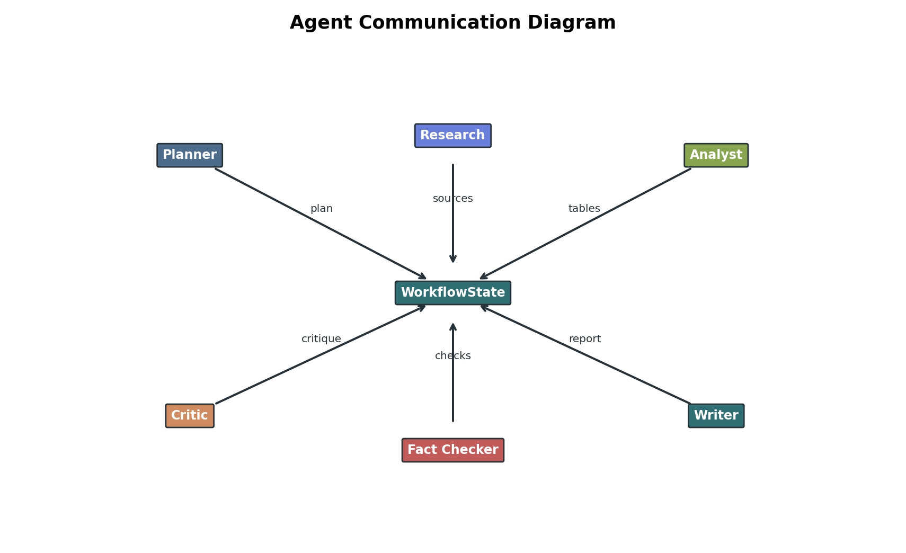 | 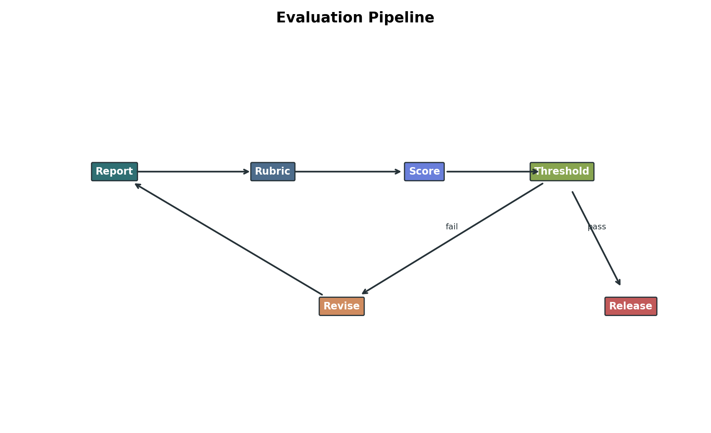 | 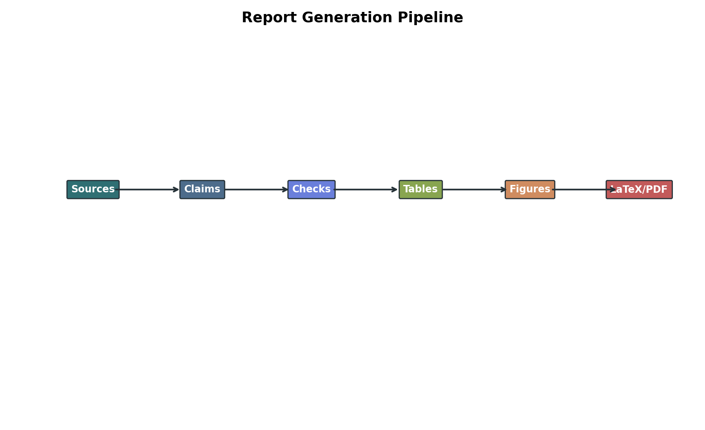 |

| Evidence by theme | Quality radar | Conceptual grounding |
| --- | --- | --- |
| 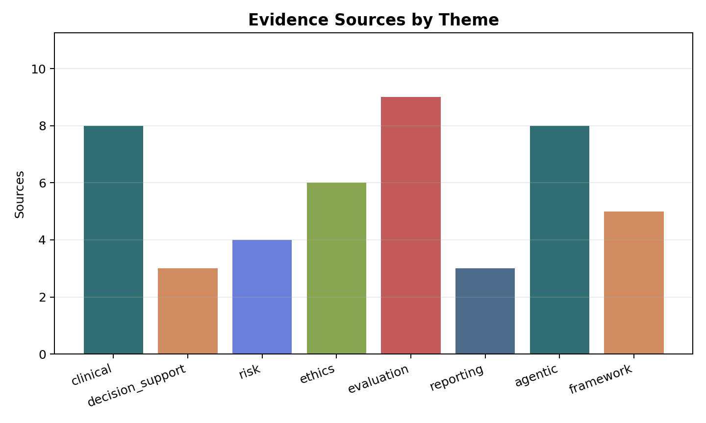 | 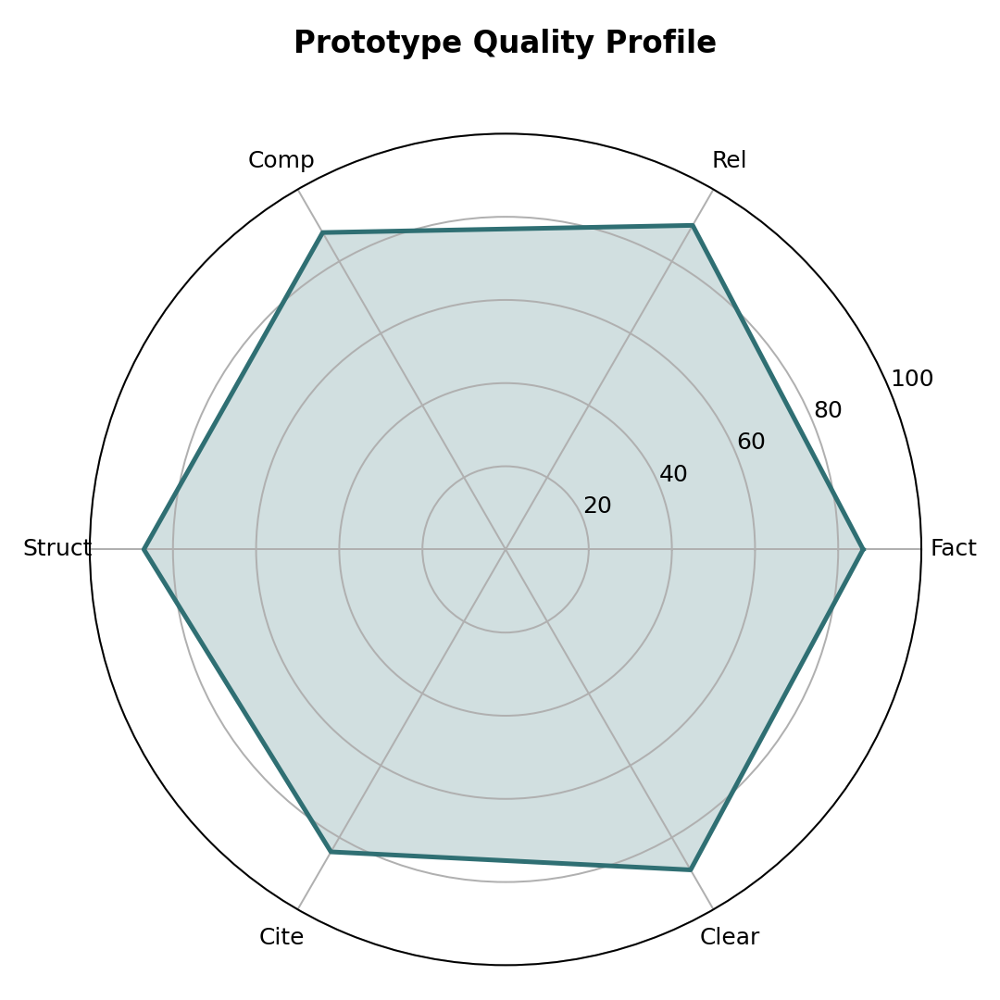 | 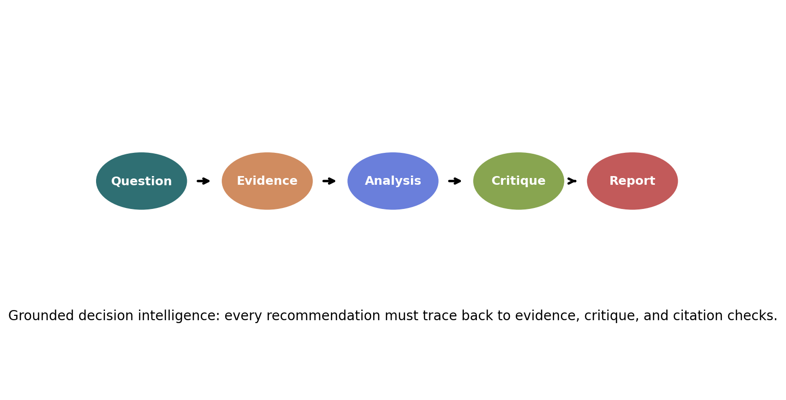 |

### Demo run summaries

| Evaluation score | Workflow result | Generated figures |
| --- | --- | --- |
| 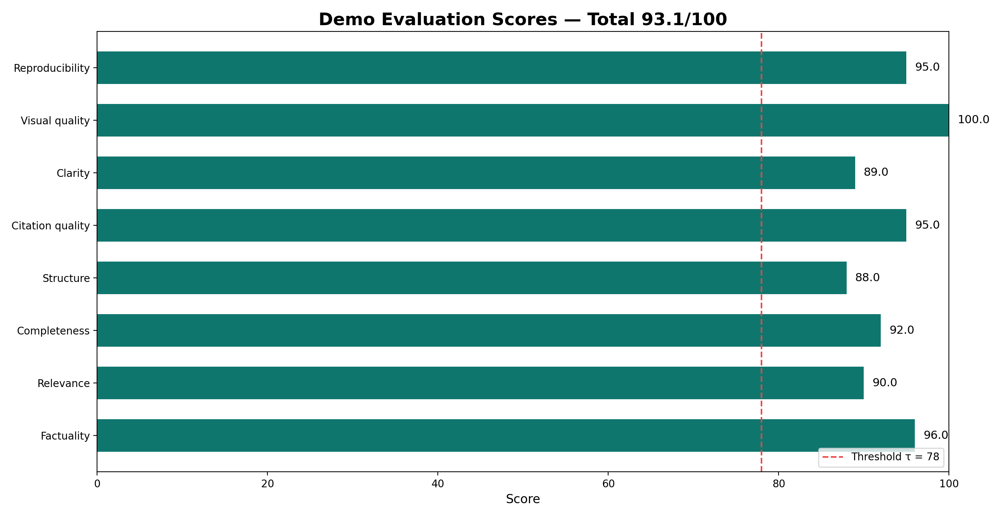 | 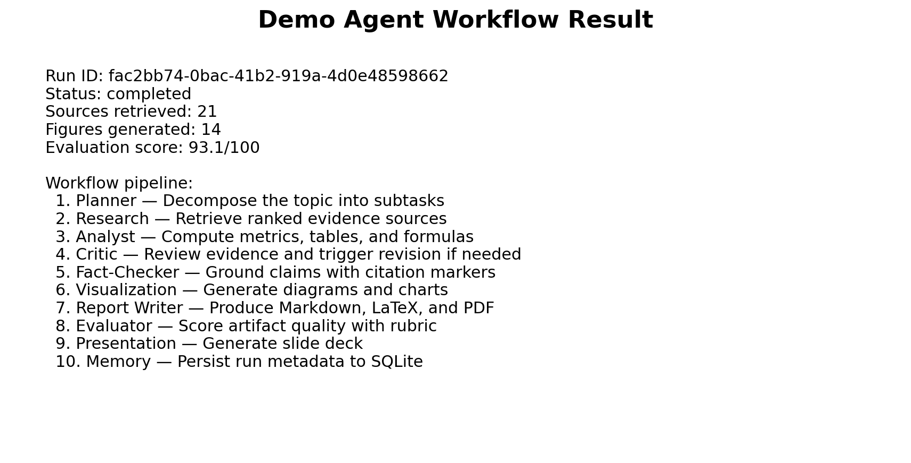 | 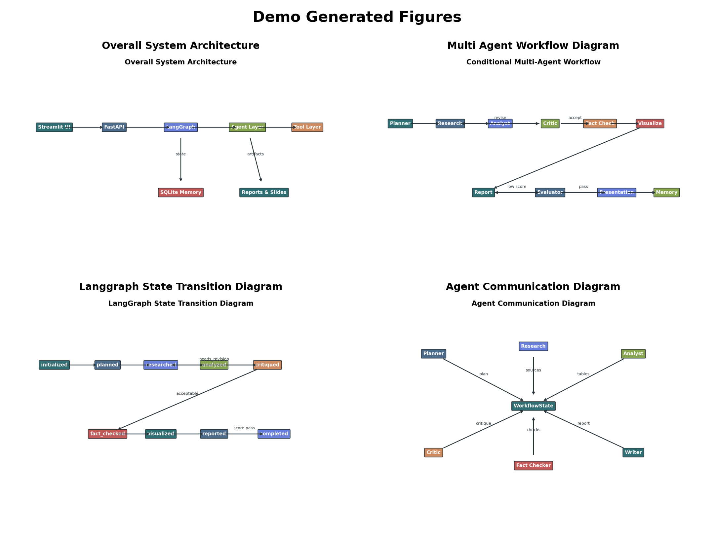 |

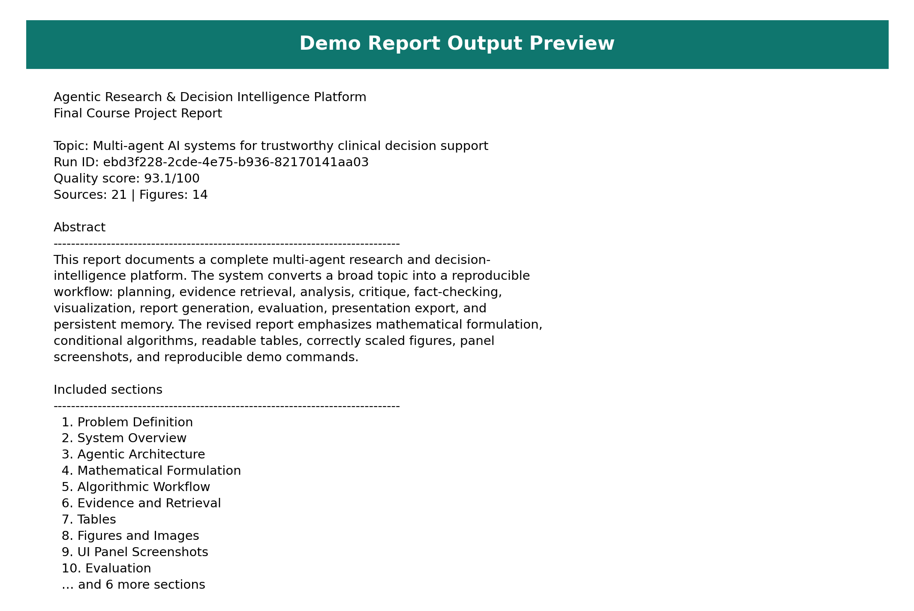

## Running With Real LLM/Search Mode

Mock mode is the supported default for reproducible grading. To extend real mode:

1. Set `USE_MOCK_LLM=false`.
2. Add provider keys to `.env`, such as `OPENAI_API_KEY`, `TAVILY_API_KEY`, or `SERPAPI_API_KEY`.
3. Implement provider adapters behind the existing tool interfaces without changing agent state contracts.

The current repository does not hardcode provider calls or secrets.

## AI Usage Transparency

This project was developed with AI-assisted engineering tools used as **development assistants**, not as unsupervised authors. The student defined requirements, chose the multi-agent architecture, reviewed generated outputs, ran tests, validated deliverables, and prepared the final submission.

| Tool | Role in development |
| --- | --- |
| **ChatGPT** | Planning, architecture design, prompt engineering, documentation drafting, report structure, debugging guidance |
| **OpenAI Codex / Codex-style assistant** | Code generation, tests, scripts, project structure, documentation |
| **Cursor AI** | AI-assisted IDE for refactoring, LaTeX/PDF report polishing, and consistency checks |
| **NotebookLM** | Presentation drafting and speaker notes from project documents |

The **implemented system** also contains its own internal multi-agent AI workflow (Planner, Research, Analyst, Critic, Fact-Checker, Visualization, Report Writer, Evaluator, Presentation, Memory). Development AI tools and internal runtime agents are separate concepts.

See:

- [`docs/AI_USAGE_GUIDE.md`](docs/AI_USAGE_GUIDE.md) — external AI tools, human oversight, responsible use
- [`docs/AI_GUIDE.md`](docs/AI_GUIDE.md) — internal runtime agents, state, routing, mock mode

## Limitations

- The default corpus is static so the project is reproducible without paid keys.
- Mock mode demonstrates architecture and workflow behavior, not live clinical evidence surveillance.
- Claim verification uses tagged source metadata rather than full natural-language inference.
- The clinical scenario is for research demonstration only and must not be used for patient-specific diagnosis or treatment.
- Production deployment would require security review, PHI controls, human approval, monitoring, and formal clinical validation.

## Troubleshooting

If imports fail, install dependencies with `pip install -r requirements.txt`.

If Matplotlib complains about cache directories, set:

```bash
export MPLCONFIGDIR=outputs/logs/matplotlib
```

If no API keys are configured, keep:

```bash
USE_MOCK_LLM=true
```

The project is designed to run without paid API keys.
