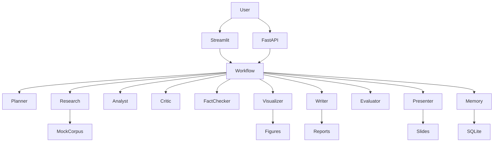

# Architecture

## System Architecture

## Folder Structure

- `app/agents/`: specialized agent classes.
- `app/graph/`: workflow state, node wrappers, and orchestration.
- `app/tools/`: reusable search, citation, report, file, and visualization tools.
- `app/tools/latex_report_tools.py`: LaTeX report source generation, bibliography writing, and PDF compilation.
- `app/models/`: Pydantic-compatible schemas.
- `app/storage/`: SQLite memory.
- `app/api/` and `app/main.py`: FastAPI application.
- `app/ui/`: Streamlit UI.
- `data/`: mock evidence corpus and example inputs.
- `outputs/`: generated run artifacts.
- `report/`: canonical final report.
- `presentation/`: canonical final presentation.
- `tests/`: unit, integration, and end-to-end tests.

## Data Flow

1. User submits a topic.
2. Planner creates subtasks.
3. Research retrieves ranked sources.
4. Analyst computes metrics and tables.
5. Critic either requests more research or approves.
6. Fact-checker grounds major claims.
7. Visualization creates diagrams and charts.
8. Report writer creates Markdown, LaTeX source, references, and a compiled PDF when `pdflatex` is available.
9. Evaluator scores the output.
10. Presentation agent creates slides.
11. Memory stores run metadata.

## State Schema

`WorkflowState` contains the complete run record: run ID, query, plan, sources, notes, analysis, tables, critique, claim checks, figures, artifact paths, evaluation score, status, and errors.

## Tool Layer

Tools are pure functions wherever possible. They avoid hidden global state and write only to configured output locations.

## Storage Layer

SQLite is used for local persistence. The schema stores run-level metadata and serialized state. Production deployments can replace this with Postgres without changing agent contracts.
