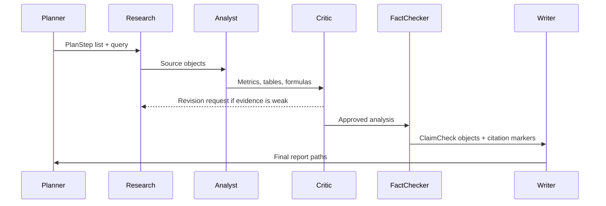

# Agent Communication Protocol

```mermaid
sequenceDiagram
                  participant Planner
                  participant Research
                  participant Analyst
                  participant Critic
                  participant FactChecker
                  participant Writer
                  Planner->>Research: PlanStep list + query
                  Research->>Analyst: Source objects
                  Analyst->>Critic: Metrics, tables, formulas
                  Critic-->>Research: Revision request if evidence is weak
                  Critic->>FactChecker: Approved analysis
                  FactChecker->>Writer: ClaimCheck objects + citation markers
                  Writer->>Planner: Final report paths
```
