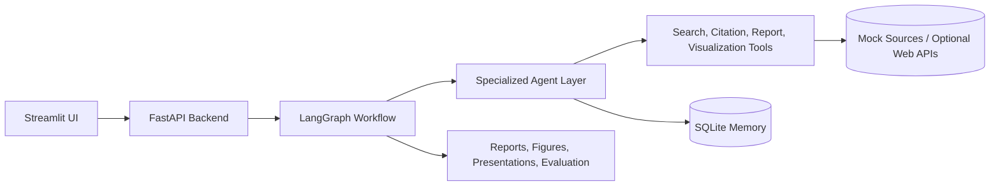

# Overall System Architecture

```mermaid
flowchart LR
                  UI[Streamlit UI] --> API[FastAPI Backend]
                  API --> Graph[LangGraph Workflow]
                  Graph --> Agents[Specialized Agent Layer]
                  Agents --> Tools[Search, Citation, Report, Visualization Tools]
                  Agents --> Memory[(SQLite Memory)]
                  Tools --> Data[(Mock Sources / Optional Web APIs)]
                  Graph --> Outputs[Reports, Figures, Presentations, Evaluation]
```
