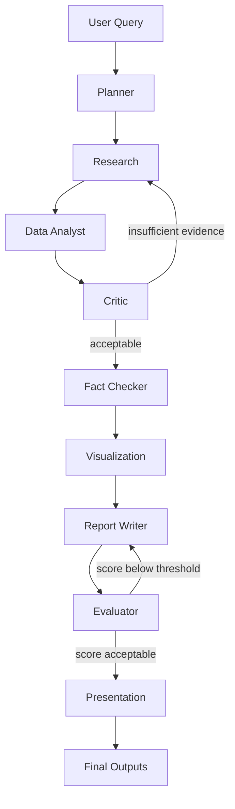

# LangGraph Multi-Agent Workflow

```mermaid
flowchart TD
                  Q[User Query] --> P[Planner]
                  P --> R[Research]
                  R --> A[Data Analyst]
                  A --> C[Critic]
                  C -->|insufficient evidence| R
                  C -->|acceptable| F[Fact Checker]
                  F --> V[Visualization]
                  V --> W[Report Writer]
                  W --> E[Evaluator]
                  E -->|score below threshold| W
                  E -->|score acceptable| S[Presentation]
                  S --> O[Final Outputs]
```
